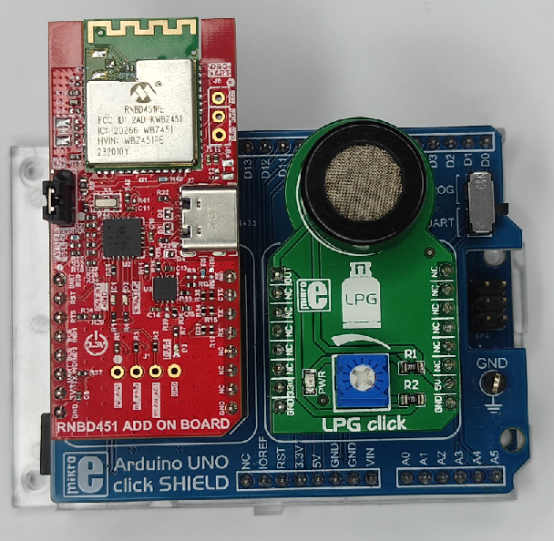
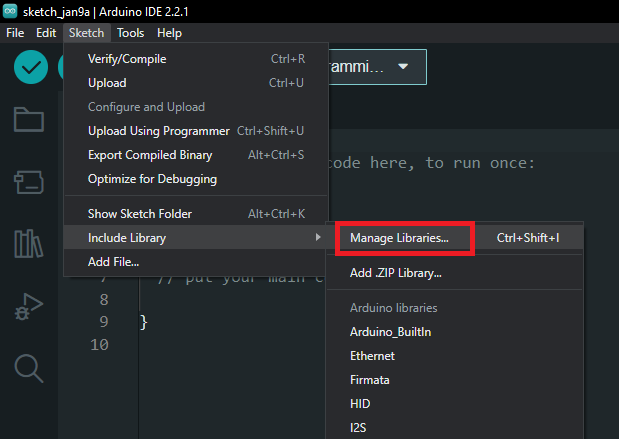
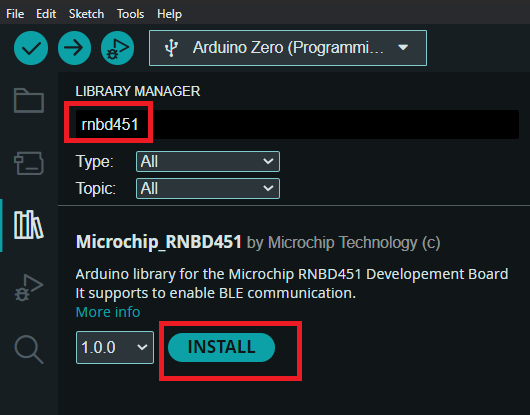
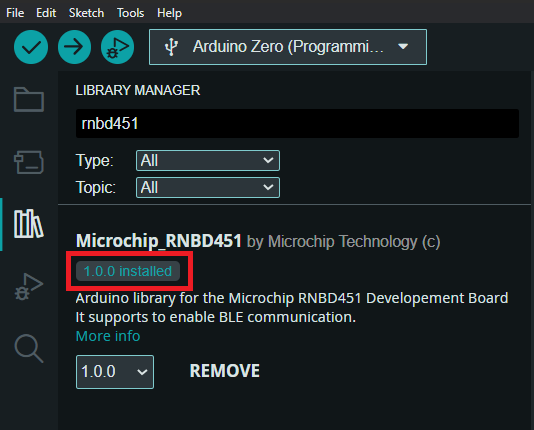
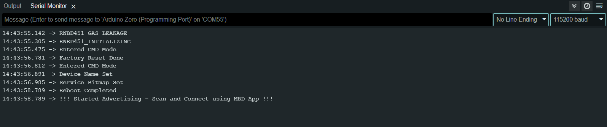

# RNBD451 WITH ARDUINO ZERO AS BLE GAS LEAKAGE SENSOR


> "IoT Made Easy!" 

Devices: **| RNBD451 | SAMD21 |**<br>
Features: **| BLE |**


## ⚠ Disclaimer

<p><span style="color:red"><b>
THE SOFTWARE ARE PROVIDED "AS IS" AND GIVE A PATH FOR SELF-SUPPORT AND SELF-MAINTENANCE. This repository contains example code intended to help accelerate client product development. </br>

For additional Microchip repos, see: <a href="https://github.com/Microchip-MPLAB-Harmony" target="_blank">https://github.com/Microchip-MPLAB-Harmony</a>

Checkout the <a href="https://microchipsupport.force.com/s/" target="_blank">Technical support portal</a> to access our knowledge base, community forums or submit support ticket requests.
</span></p></b>

## Contents

1. [Introduction](#step1)
1. [Bill of materials](#step2)
1. [Software Setup](#step3)
1. [Hardware Setup](#step4)
1. [Arduino Sketch Configuration](#step5)
1. [Run the demo](#step6)

## 1. Introduction<a name="step1">

### Getting started with adding RNBD451 with Arduino Zero

This application shows how to use the RNBD451 along with the Arduino Zero to develop a BLE Gas Leakage sensor application with LPG CLICK. The Arduino Zero Board sends RN instructions to establish the Gas Leakage sensor application, which can be monitored in the Microchip Bluetooth Data application.


## 2. Bill of materials<a name="step2">

| TOOLS | QUANTITY |
| :- | :- |
| [RNBD451 Add On Board](https://www.microchip.com/en-us/development-tool/ev25f14a#:~:text=The%20RNBD451%20Add%20On%20Board,%E2%84%A2%20Add%20On%20Bus%20Standard.) | 1 |
| [Arduino UNO click shield](https://www.mikroe.com/arduino-uno-click-shield) | 1 |
| [Arduino Zero](https://store-usa.arduino.cc/products/arduino-zero) | 1 |
| [LPG Click](https://www.mikroe.com/lpg-click) | 1 |

## 3. Software Setup<a name="step3">

- [Arduino IDE 2.2.1](https://www.arduino.cc/en/software)

## 4. Hardware Setup<a name="step4">

- Connect the RNBD451 Module to the Mikro BUS 1 and LPG Click to the Mikro BUS 2 of the Arduino UNO click SHIELD as shown below.



## 5. Arduino Sketch Configuration<a name="step5">

**Step 1** - Open the Arduino IDE and navigate to Sketch->Include Library->Manage Libraries.



**Step 2** - The Library Manager window will open, search for RNBD451 to install.



**Step 3** - After Installing the driver open a new project from File->New Sketch.



**Step 4** - Copy the code given below and paste it in your .ino file or you can find the Sketch file in this repo named as "RNBD_GAS_LEAKAGE.ino".

```
/*
    (c) 2024 Microchip Technology Inc. and its subsidiaries.
    
    Subject to your compliance with these terms, you may use Microchip software and any 
    derivatives exclusively with Microchip products. It is your responsibility to comply with third party 
    license terms applicable to your use of third party software (including open source software) that 
    may accompany Microchip software.
    
    THIS SOFTWARE IS SUPPLIED BY MICROCHIP "AS IS". NO WARRANTIES, WHETHER 
    EXPRESS, IMPLIED OR STATUTORY, APPLY TO THIS SOFTWARE, INCLUDING ANY 
    IMPLIED WARRANTIES OF NON-INFRINGEMENT, MERCHANTABILITY, AND FITNESS 
    FOR A PARTICULAR PURPOSE.
    
    IN NO EVENT WILL MICROCHIP BE LIABLE FOR ANY INDIRECT, SPECIAL, PUNITIVE, 
    INCIDENTAL OR CONSEQUENTIAL LOSS, DAMAGE, COST OR EXPENSE OF ANY KIND 
    WHATSOEVER RELATED TO THE SOFTWARE, HOWEVER CAUSED, EVEN IF MICROCHIP 
    HAS BEEN ADVISED OF THE POSSIBILITY OR THE DAMAGES ARE FORESEEABLE. TO 
    THE FULLEST EXTENT ALLOWED BY LAW, MICROCHIP'S TOTAL LIABILITY ON ALL 
    CLAIMS IN ANY WAY RELATED TO THIS SOFTWARE WILL NOT EXCEED THE AMOUNT 
    OF FEES, IF ANY, THAT YOU HAVE PAID DIRECTLY TO MICROCHIP FOR THIS 
    SOFTWARE.
*/

#include <Arduino.h>
#include "rnbd.h"
#include "rnbd_interface.h"

#define DEFAULT_BAUDRATE 115200
#define SERIAL_BAUDRATE 115200
#define BLEserial Serial1
#define USBserial Serial
#define RST_PIN A3
#define LPG_PIN A1

bool Err;
bool initialize = false;
const char DevName[] = "RNBD451_GAS_LEAK";
uint8_t service_uuid = 0xC0;
unsigned long previousMillis = 0;
const long interval = 1000;

typedef enum {
  /* TODO: Define states used by the application state machine. */
  RNBD_INIT,
  RNBD_FACTORY_RESET,
  RNBD_CMD,
  RNBD_CMD1,
  RNBD_SET_NAME,
  RNBD_SET_PROFILE,
  RNBD_REBOOT,
} STATES;

typedef struct
{
  /* The application's current state */
  STATES state;

} RNBD_STATE;

RNBD_STATE rnbd_state;
BLE BLE_RNBD;

void setup() {  
  BLE_RNBD.setReset(RST_PIN);
  BLE_RNBD.initBleStream(&BLEserial);
  //Arduino UART Serial
  USBserial.begin(SERIAL_BAUDRATE);
  //RNBD UART Serial
  BLEserial.begin(DEFAULT_BAUDRATE);
  delay(1000);
  USBserial.println("RNBD451 GAS LEAKAGE");
  rnbd_state.state = RNBD_INIT;
  initialize = true;
}

void loop() {
  if (initialize == true) {
    RNBD_DP_INIT();
  } else {
    unsigned long currentMillis = millis();
    if (currentMillis - previousMillis >= interval) {
      previousMillis = currentMillis;
      gasLeakage();
    }
    serial_transfer();
  }
}

void serial_transfer() {
  // read from RNBD451 and Print on Arduino Zero
  if (BLEserial.available()) {
    String BU_data = BLEserial.readString();
    USBserial.println(BU_data);
  }
  // read from Arduino Zero and Print on RNBD451
  if (USBserial.available()) {
    String AR_data = USBserial.readString();
    BLEserial.print(AR_data);
  }
}

void RNBD_DP_INIT() {
  switch (rnbd_state.state) {
    case RNBD_INIT:
      {
        Err = BLE_RNBD.RNBD_Init();
        if (Err) {
          Err = false;
          USBserial.println("RNBD451_INITIALIZING");
          rnbd_state.state = RNBD_CMD;
        }
      }
      break;
    case RNBD_CMD:
      {
        Err = BLE_RNBD.RNBD_EnterCmdMode();
        if (Err) {
          Err = false;
          USBserial.println("Entered CMD Mode");
          rnbd_state.state = RNBD_FACTORY_RESET;
        }
      }
      break;
    case RNBD_FACTORY_RESET:
      {
        Err = BLE_RNBD.RNBD_FactoryReset();
        RNBD.DelayMs(1000);
        if (Err) {
          Err = false;
          USBserial.println("Factory Reset Done");
          rnbd_state.state = RNBD_CMD1;
        }
      }
      break;
    case RNBD_CMD1:
      {
        Err = BLE_RNBD.RNBD_EnterCmdMode();
        if (Err) {
          Err = false;
          USBserial.println("Entered CMD Mode");
          rnbd_state.state = RNBD_SET_NAME;
        }
      }
      break;
    case RNBD_SET_NAME:
      {
        Err = BLE_RNBD.RNBD_SetName(DevName, strlen(DevName));
        if (Err) {
          Err = false;
          USBserial.println("Device Name Set");
          rnbd_state.state = RNBD_SET_PROFILE;
        }
      }
      break;
    case RNBD_SET_PROFILE:
      {
        Err = BLE_RNBD.RNBD_SetServiceBitmap(service_uuid);
        if (Err) {
          Err = false;
          USBserial.println("Service Bitmap Set");
          rnbd_state.state = RNBD_REBOOT;
        }
      }
      break;
    case RNBD_REBOOT:
      {
        Err = BLE_RNBD.RNBD_RebootCmd();
        RNBD.DelayMs(1500);
        if (Err) {
          Err = false;
          USBserial.println("Reboot Completed");
          initialize = false;
          serialFlush();
          USBserial.println("!!! Started Advertising - Scan and Connect using MBD App !!!");
        }
      }
      break;
  }
}

void serialFlush() {
  while (BLEserial.available() > 0) {
    char rnbd_temp = BLEserial.read();
  }
  while (USBserial.available() > 0) {
    char serial_temp = USBserial.read();
  }
}

void gasLeakage() {
  int sensorValue = analogRead(LPG_PIN);
  if (sensorValue > 700) {
    BLEserial.println("!!! Gas Leakage Detected !!!");
  }
}


```

**Step 5** - Save and Verify the sketch.

**Step 6** - Once the Sketch is verified select the programming port and upload the sketch.


**Step 7** - The Application Serial logs can be viewed in Arduino Serial Monitor or  [TERA TERM](https://download.cnet.com/Tera-Term/3000-2094_4-75766675.html).

- Baud Rate: 115200



**Step 8** - After the BLE starts advertising we can connect through MBD App to check the GAS Leakage Status.


## 6. Run the demo<a name="step6">

- After programming the board, the expected application behavior is shown in the below [video](https://github.com/MicrochipTech/RNBD451_ARDUINO_BLE_GAS_LEAKAGE/blob/main/docs/demo.gif).

	
